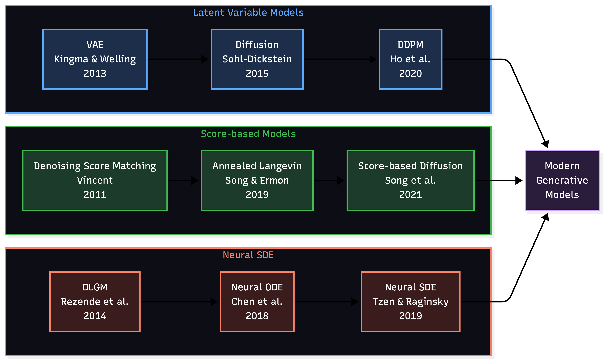

# 1. Предпосылки

Немножко погрузимся в историю генеративных моделей...
Современные генеративные модели пришли к одним и тем же идеям тремя независимыми путями. Посмотрим, какое место занимает Neural SDE в этих исторических разветвлениях

## Три независимые исторические ветки

Все три ветки независимо пришли к одному выводу: оптимальный способ генерировать данные — моделировать их как непрерывный стохастический процесс.
