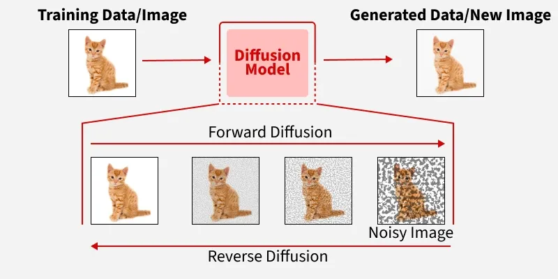
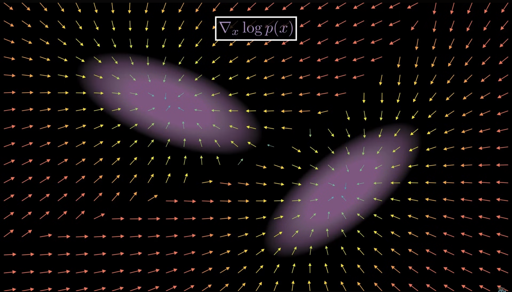
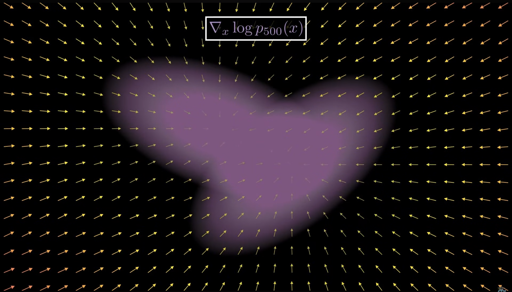
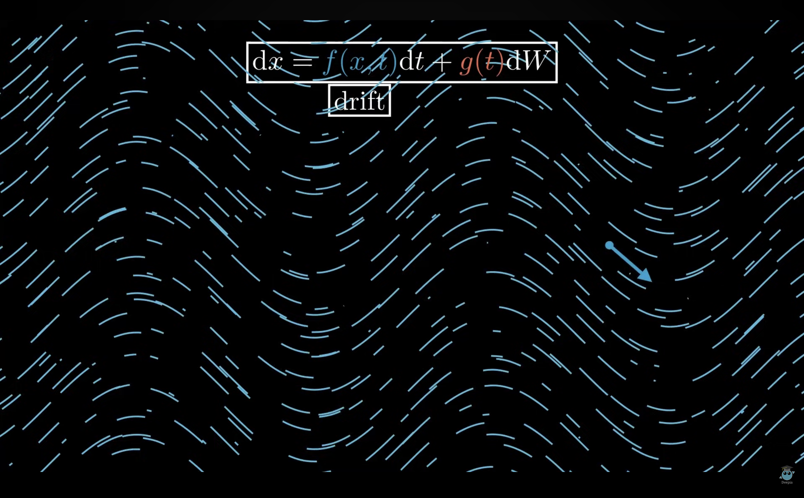
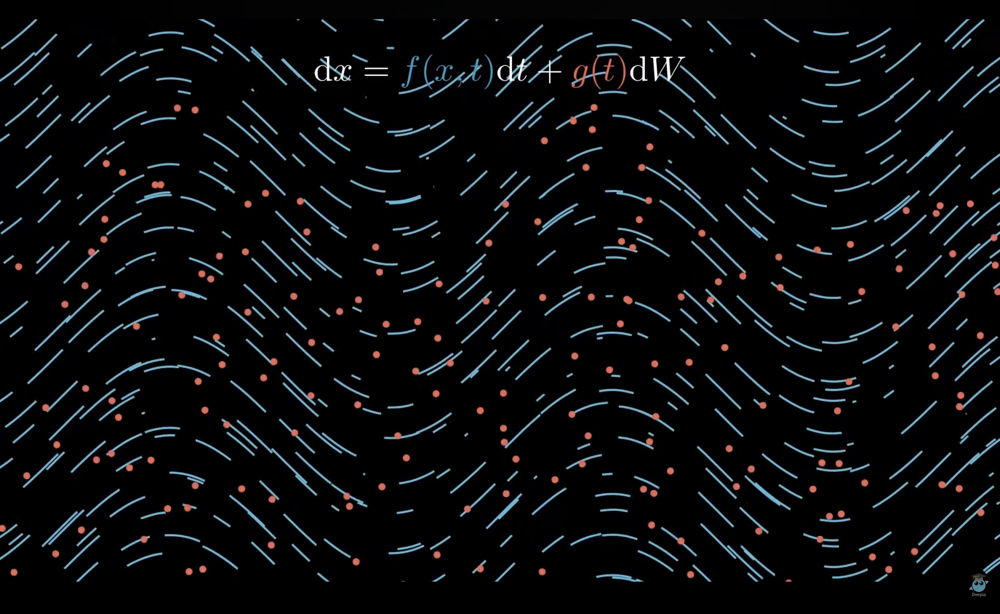

# Предпосылки и история

Немножко погрузимся в историю генеративных моделей...
Современные генеративные модели пришли к одним и тем же идеям тремя независимыми путями. Посмотрим, какое место занимает Neural SDE в этих исторических разветвлениях

## Три независимые исторические ветки

Все три ветки независимо пришли к одному выводу: оптимальный способ генерировать данные — моделировать их как непрерывный стохастический процесс.

## Сравнение подходов

### Latent Variable Models

Каждый объект данных — картинка, звук, текст — можно представить как точку в высокомерном пространстве. VAE и диффузионные модели учат сжимать эти точки в компактное латентное пространство, а потом разворачивать обратно.

Ключевая идея диффузионных моделей: данные постепенно зашумляются по заранее известному расписанию — а модель учится убирать этот шум шаг за шагом. Forward process фиксирован, обучается только обратный.

### Score-based Models

Другой взгляд на ту же задачу. Вместо того чтобы явно моделировать распределение данных, score-based модели учат градиент его плотности — в каком направлении она растёт быстрее всего.

Реальные данные живут в областях с высокой плотностью априорного распределения. Случайный шум — там где плотность низкая. Задача генерации сводится к тому чтобы привести точку из области низкой плотности в область высокой.

Этот градиент называется _score function_:

$$s(x) = \nabla_x \log p(x)$$

Он показывает направление наискорейшего роста плотности в каждой точке пространства — своеобразный компас который всегда указывает в сторону более реалистичных данных.

Генерация устроена просто: подаём на вход случайный шум и итеративно движемся в сторону роста плотности следуя score function. При этом на каждом шаге добавляем немного случайности — иначе все сэмплы сошлись бы в одну точку максимальной плотности, а не покрывали бы всё разнообразие реальных данных:

$$x_{t+1} = x_t + \left[-\frac{1}{2}\beta(t)x_t - \beta(t)s_\theta(x_t, t)\right]\Delta t + \sqrt{\beta(t)}\sqrt{\Delta t}\,\epsilon$$

где \
$s_\theta(x_t, t)$ — нейросеть аппроксимирующая score function \
$\beta(t)$ — шедулер шума контролирующий скорость диффузии \
$\epsilon \sim \mathcal{N}(0, I)$ — случайный шум на каждом шаге

### Neural SDE

#### От детерминированных моделей к стохастическим

Ordinary differential equations (ODE) давно служат удобной абстракцией для детерминированных итеративных моделей. Chen et al. (2018) сделали следующий шаг — предложили Neural ODE, где вся нелинейная трансформация представляется одним ODE, а вместо фиксированного числа слоёв используется чёрный ящик-солвер:

$$\frac{dX_t}{dt} = f(X_t, t;\, \theta)$$

Это естественно переносится на вероятностное моделирование. Глубокие генеративные модели можно рассматривать как нестационарные марковские цепи — а значит, можно рассмотреть их непрерывный предел.

#### Deep Latent Gaussian Models

Отправной точкой служат Deep Latent Gaussian Models (DLGM, Rezende et al., 2014) — гибкий класс генеративных моделей где латентная переменная порождается марковской цепью: на каждом шаге текущее состояние проходит через нелинейное преобразование и получает независимое гауссовское возмущение:

$$X_i = X_{i-1} + b_i(X_{i-1}) + \sigma_i Z_i, \quad Z_i \sim \mathcal{N}(0, I)$$

Когда число слоёв стремится к бесконечности, а шаг и дисперсия шума стремятся к нулю, получаем непрерывный предел — диффузионный процесс
Ито, чьи drift и коэффициент диффузии реализованы нейросетями:

$$dX_t = b(X_t, t;\, \theta)\, dt + \sigma(X_t, t;\, \theta)\, dW_t, \quad t \in [0, 1]$$

Это и есть Neural SDE.

#### Три ключевых вклада статьи

Tzen & Raginsky (2019) развивают этот фреймворк в трёх направлениях:

1. Латентное пространство Винера \
   Вся случайность модели выносится в стандартный винеровский процесс $W_t$ — непрерывный аналог независимых гауссовских векторов $Z_i$ в DLGM. Естественным латентным пространством становится пространство непрерывных путей $\mathbb{W} = C([0,1]; \mathbb{R}^d)$.

2. Вариационный вывод через Гирсанова \
   Вариационное приближение к апостериорному распределению строится через теорему Гирсанова: любая мера на пространстве путей, абсолютно непрерывная относительно меры Винера, соответствует добавлению drift-члена к стандартному винеровскому процессу.

3. Автодифференцирование в пространстве Винера \
   Градиенты вариационной свободной энергии вычисляются двумя способами:
   1. через дискретизацию Эйлера с последующим backprop
   2. через теорию стохастических потоков (Kunita, 1984) с использованием чёрного ящика-солвера для SDE
